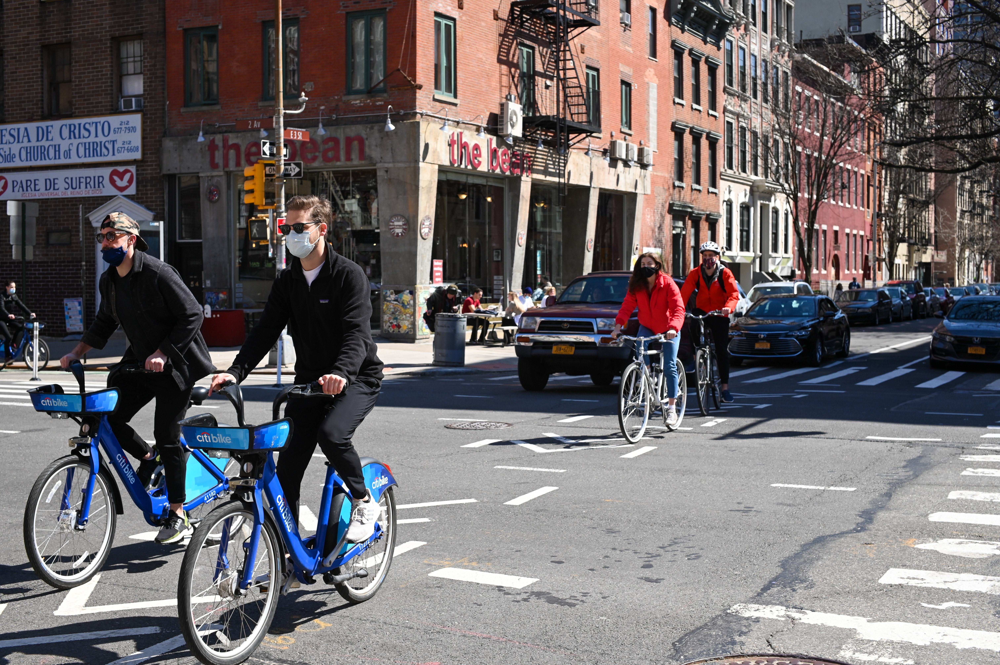
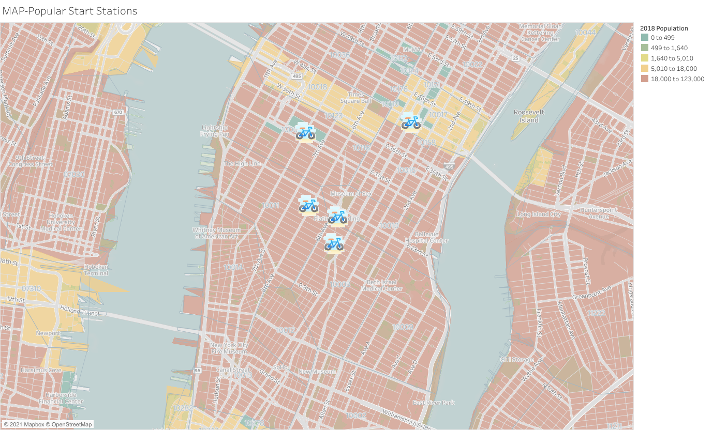
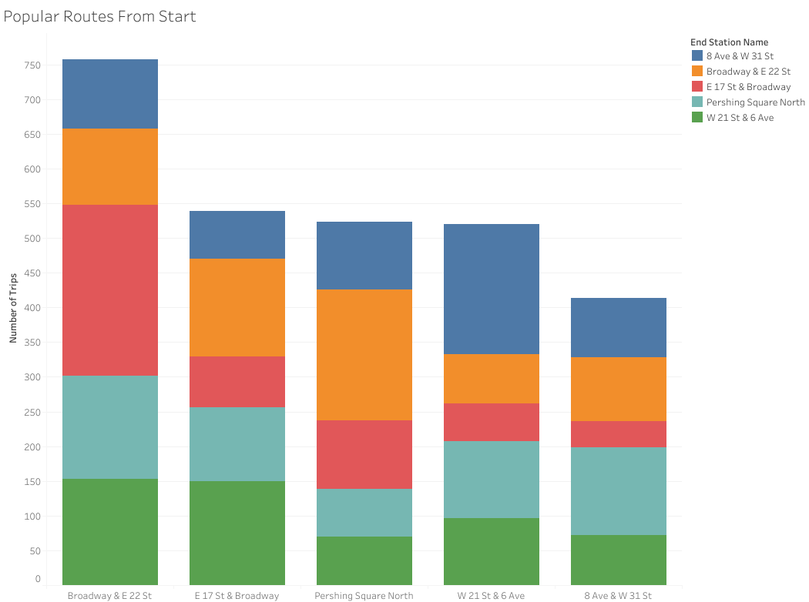
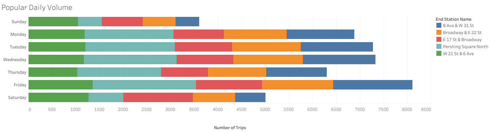
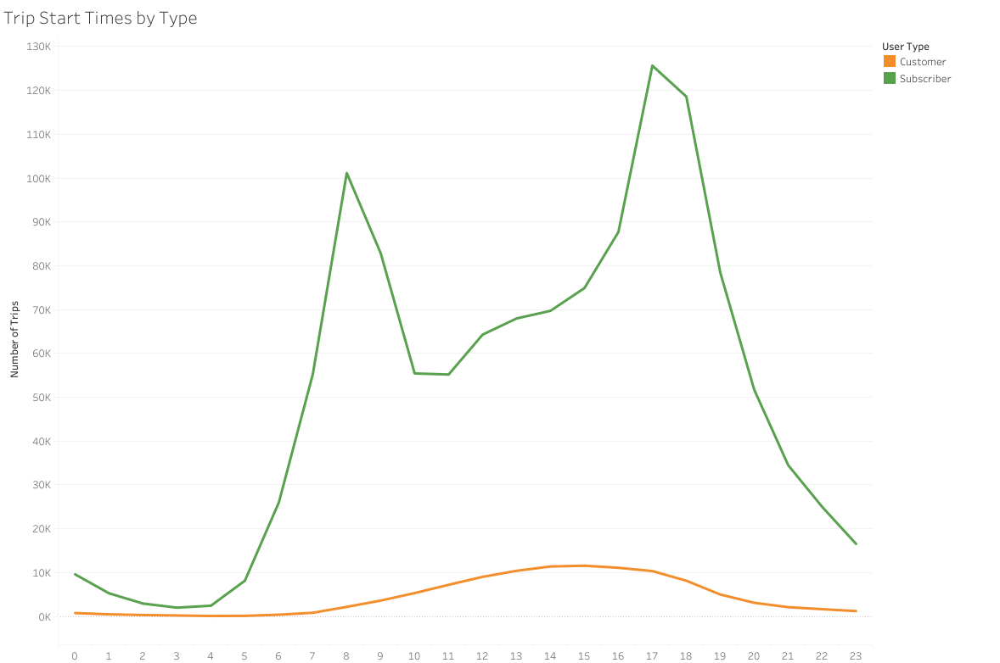
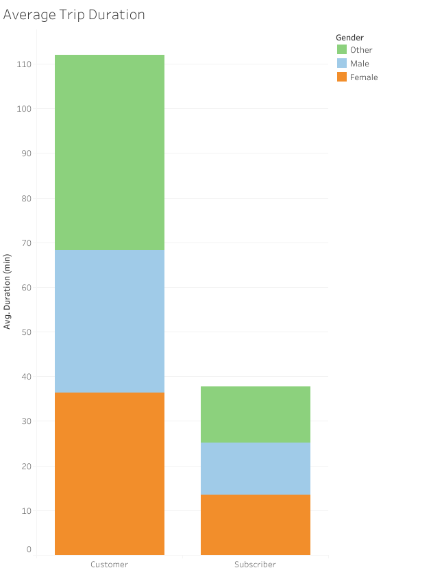
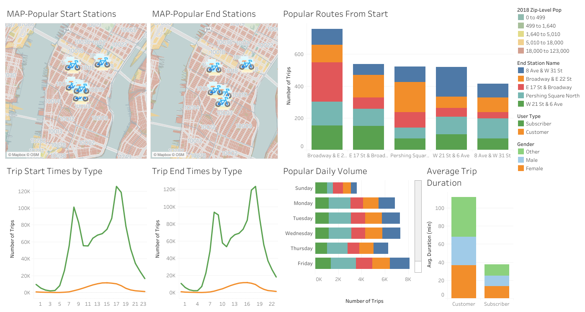
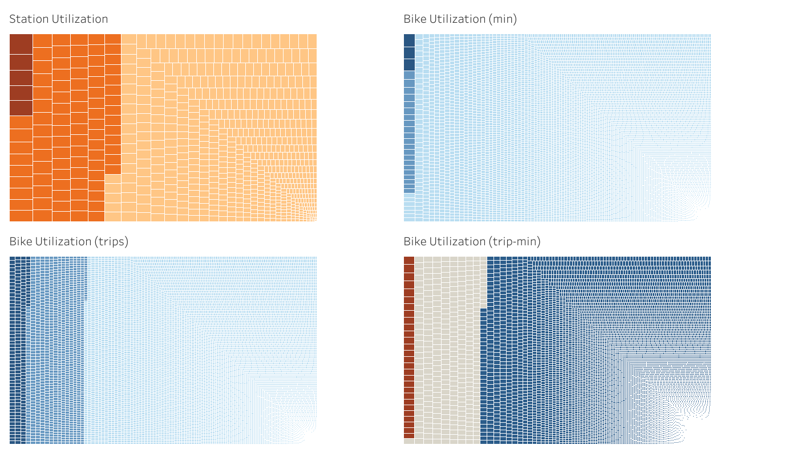

# Citi Bike Analytics
## Dashboarding and Analysis with Tableau

---
## Background & Challenge

Since 2013, the Citi Bike Program has implemented a robust infrastructure for collecting data on the program's utilization. Through the team's efforts, each month bike data is collected, organized, and made public on the [Citi Bike Data](https://www.citibikenyc.com/system-data) webpage.

The goal of this project is to aggregate the Citi Bike Trip History Logs and design a management quality report structure including static and interactive dashboard visualizations. 

[Link to Tableau Public Story](https://public.tableau.com/profile/gabriel.allen#!/vizhome/CitiBikeAnalytics_16200750459960/CitiBikeAnalytics)

---
## Dashboard & Analysis Toolkit

>* Tableau

---
## Analysis

**Station Popularity** 

Station popularity is an important metric for several reasons, the CitiBike program not only needs to know where the bikes are needed the most, but also which stations need the most attention in terms of general upkeep and security. The maps show the top 5 most frequented starting and destination stations for the program for a quick view of popularity, and the maintenance dash provides more granular station and bicycle information for attention at scale. 

Top 5 Stations: 
* 8th Ave and W 31st Street 
* Pershing Square North 
* W 21st & 6th Ave 
* Broadway & E 22nd Street 
* E 17th Street & Broadway 

**Temporal Popularity**

Knowing when stations and bicycles are being utilized is equally as important as the physical location of the assets. This information enables the user to target specific days and times to schedule maintenance activities or perhaps beef up security if that is of concern. In addition to rotational activities such as maintenance and security, we can discern some detail around the prevailing customer base.

Most of our users are clearly commuters with two distinct peaks in utilization from 7-9am and 4-6pm ET. The bulk of these users are paid subscribers, which gives us a good starting point geographically and demographically on a target audience for additional marketing campaigns geared toward beefing up ARR. Subscribers also tend to keep their travel times short and sweet, leading to a much higher trip turn rate than the more disparate users who like to take their time traveling around town at roughly a 2x trip duration to the Sub demo.

---
## Screenshots

### Primary Dashboard

### Maintenance Dashboard

